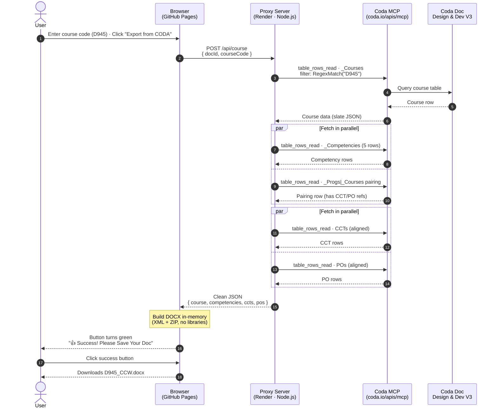

# WGU Doc Exporter — Architecture

## What it does

The WGU Doc Exporter takes a course code (e.g. `D945`) and produces a
formatted Word document — the full Course Competency Worksheet — in a
few seconds. No manual copy/paste, no formatting cleanup.

## The problem we solved

The original tool routed Coda's data through a language model (Haiku)
as a middleman. The large rich-text fields (scope notes, evidence,
standards alignment) were too big for the model to echo back reliably —
we got timeouts and truncated documents. **The fix was to cut the model
out of the data path entirely.**

## The three moving parts

### 1. The UI — a single HTML page on GitHub Pages
- No build step, no install — anyone with the link can use it
- All the Word-document assembly actually happens right here in the browser
- React + Babel loaded from CDN

### 2. The proxy server — a small Node.js service on Render
- Takes course codes from the UI, talks to Coda, returns clean JSON
- Stateless, no database, ~250 lines of code
- Free to run

### 3. Coda MCP (Model Context Protocol)
- Coda's official structured-data API
- Supports rich filter formulas — that's how we handle trailing whitespace
  and case-insensitive matching
- We use a **readonly** token — the server literally cannot modify Coda

## Why it's designed this way

- **The browser builds the `.docx` itself.** We're not shipping 500 KB
  Word files over the network. The browser assembles the doc from the
  raw JSON. Fast, no temp-file management, no server-side storage of
  user data.
- **The server is a thin translator.** Its only job is to know which
  Coda tables/columns to read and normalize the response. Easy to
  maintain, easy to extend.
- **Nothing is stored.** Every export pulls fresh data from Coda. No
  cache to invalidate, no stale documents.

## What it costs us

- **Free** — GitHub Pages is free, Render's free tier handles this
  easily, Coda's API is free for your account
- **Trade-off**: Render's free tier sleeps after 15 min idle, so the
  first export of the day has a ~30 s cold-start delay

## What could break it

- Someone renames columns in Coda → server needs a one-line update
- Token gets revoked or loses readonly permission → exports fail with a
  clear error message
- Coda changes their MCP schema (rare) → SDK update

## What's next

Easy to add: SSD, CSBD, or any other document type — each one is
~100 lines of XML builder in the UI and some new column mappings in the
server. The fetch pipeline doesn't change.

---

## Data flow

---

## Component detail

| Layer | Where it lives | Language | Responsibility |
|---|---|---|---|
| UI | `index.html` on GitHub Pages | React (CDN) + Babel (CDN) | Take user input, POST to proxy, assemble DOCX, trigger download |
| Proxy | `server.js` on Render | Node.js (ESM) | Receive POST, call Coda MCP, normalize data, return JSON |
| Data | Coda doc `4YIajnJqvo` | Coda tables & formulas | Source of truth for courses, competencies, CCTs, POs |

### Coda tables used

| Purpose | Grid ID | Notes |
|---|---|---|
| Courses | `grid-8i2Q6-eoTP` | Course row with scope notes, evidence, LR strategy, tools |
| Program–Course pairing | `grid-fEebuvIQBl` | The bridge that maps a course to its aligned CCTs and POs |
| Competencies | `grid-VZwiNNkP1B` | Per-course competency rows with skills, standards, modality |
| Cross-Cutting Themes | `grid-bdbEJT9Kuq` | `_PC \| _CCTs` — one row per (course, theme) pair |
| Program Outcomes | `grid-tUkDsBwjVg` | `_Progs \| _Courses to _Program Outcomes` — one row per (course, outcome) pair |
